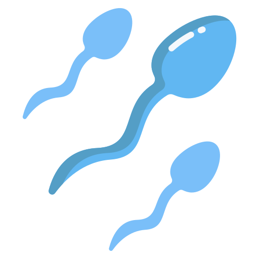
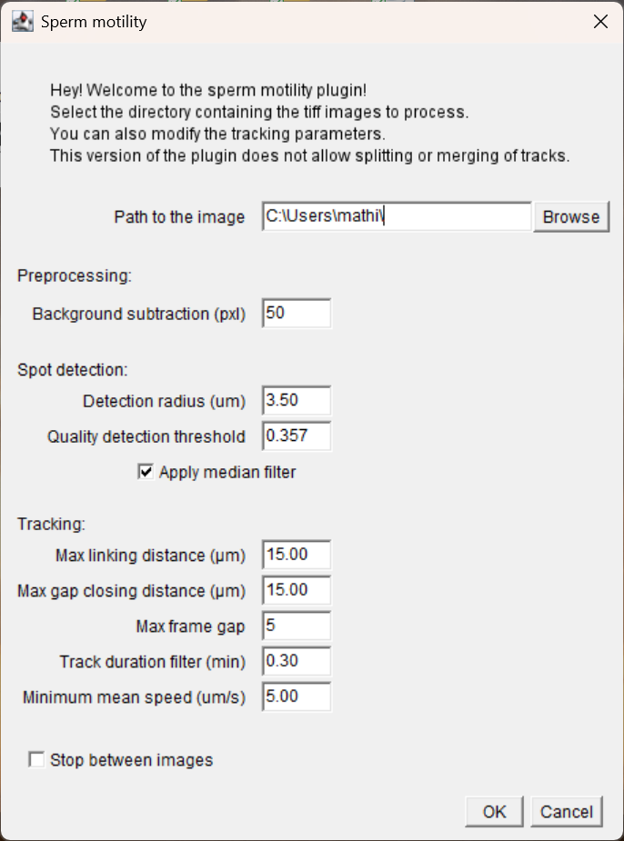
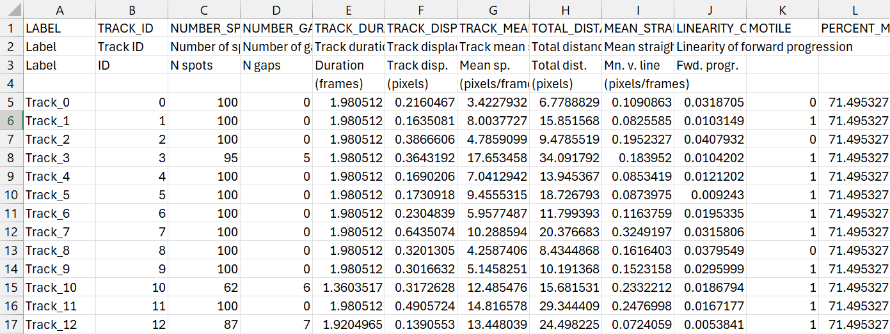

# Sperm Motility

This **Fiji plugin** is intended to provide an automated analysis 
of sperm motility, by tracking the live fluorescent sperm over time. 
This plugin takes as input a folder of TIF images, and outputs 
a CSV file with raw tracking results.

## User guide

### 1. Installation

#### a. Fiji download

First of all, you need to have **Fiji** installed on your computer. You can download it [here](https://fiji.sc/).

> **Note:** When extracting the downloaded .zip file, it is best to choose the root of your drive as the location 
(e.g. `C:/Fiji.app` on Windows or `/Applications/Fiji.app` on macOS).

#### b. Dependencies

Next, you will need to add the `csv-commons.jar` dependency to the **jars** folder of your Fiji installation.
This file is required for csv file handling.

The only other required dependency is `clij2`, which is already included in the Fiji installation.
To check if it is installed, open Fiji and go to the *Help* menu and select *Update...*. 
Then click *Manage update sites* and make sure that both `clij` and `clij2` update site are checked. 
Click on *Close*, then click on *Apply Changes*, and restart Fiji to apply the changes.
Follow [this link](https://clij.github.io/clij2-docs/installationInFiji) for more guidance on the clij2 installation.

#### c. Plugin download

The plugin is available for download [here](https://github.com/matou1604/trackmate_sperm_motility/blob/main/target/project-template-1.0.0-SNAPSHOT.jar).
Feel free to rename the file to something like *SpermMotility-V1.jar* for easier identification.

Once downloaded, you can drag the `.jar` file into a specific folder of the ImageJ folder. 
First, find the ImageJ file location by right-clicking on the app and selecting *open file location*. 
Then drag the `.jar` file into the **plugins** folder. The complete path should be something like this: `C:\Fiji.app\plugins`. You can rename the file if you want to.

Restart ImageJ if it was open and the plugin will be available in the *Plugins* menu:

    

### 2. Running the plugin

When running the plugin, a user interface window will appear.

    

- Select the folder containing the TIF   images you want to analyze. 
A results folder will be created in the same directory as the input folder, and the results will be saved there.

- You can then modify the parameters of the tracking part of the analysis: 
    - **Background subtraction radius**: the radius of the background subtraction circle, in pixels.
    - **Detection radius**: the radius of the detection circle, in µm.
    - **Quality detection threshold**: the minimum quality of the detection. This value is subjective to each experiment, and should be adjusted for each dataset.
    - **Apply median filter**: if checked, a median filter will be applied to the image before detection. 
    - **Max linking distance**: the maximum distance between two detections to be considered as the same sperm, in µm.
    - **Max gap closing distance**: the maximum distance between two detections to be considered as the same sperm, if they are not detected in consecutive frames, in µm.
    - **Max frame gap**: the maximum number of frames between two detections to be considered as the same sperm, if they are not detected in consecutive frames.
    - **Track duration filter**: the minimum duration of a track to be considered as valid, in minutes.
    - **Minimum mean speed**: the minimum mean speed of a track to be considered as motile, in µm/s.

During the analysis, the plugin will display the image being analysed. 
If you want to see the results of the analysis, you can check the ***Stop between images*** box.

 

## Understanding the plugin

### 1. Trackmate

This plugin is based on the [Trackmate](https://imagej.net/plugins/trackmate) plugin, which is a powerful tool for tracking objects in images.
It is a plugin written in Java that scripts the trackmate plugin to automate it.
It uses the [CLIJ2](https://clij.github.io/clij2-docs/) library for GPU-accelerated image processing, which allows for fast processing of large images.

### 2. Results

The results of the analysis are saved in a CSV file in the results folder. 
The file `tracks_nameofinpoutimages.csv` contains the following columns:
1. [x] LABEL: the label of the track.
2. [x] TRACK_ID: the ID of the track.
3. [x] NUMBER_SPOTS: the number of spots in the track.
4. [x] NUMBER_GAPS: the number of frame gaps in the track.
5. [x] TRACK_DURATION: the duration of the track in minutes.
6. [x] TRACK_DISPLACEMENT: the displacement of the track in µm.
7. [x] TRACK_MEAN_SPEED: the mean speed of the track in µm/s.
8. [x] TOTAL_DISTANCE_TRAVELED: the total distance traveled by the spot in µm.
9. [x] MEAN_STRAIGHT_LINE_SPEED: the mean straight line speed of the track in µm/s.
10. [x] LINEARITY_OF_FORWARD_PROGRESSION: the linearity of forward progression of the track, calculated as the ratio between the displacement and the total distance traveled.
11. [x] MOTILE: a boolean value indicating if the track is motile or not, based on the minimum mean speed set by the user.
12. [x] PERCENT_MOTILITY: the percentage of motile tracks in the image, calculated as the number of motile tracks divided by the total number of tracks times 100.

For more information on the feature columns of the result file, you can consult the [Trackmate documentation](https://imagej.net/plugins/trackmate/analyzers/).

    

## Hardware requirements
The plugin is designed to work with any time-lapse images of small round dots. 
Due to the size of the images, a computer with at least 16GB of RAM is recommended, more is preferred.

