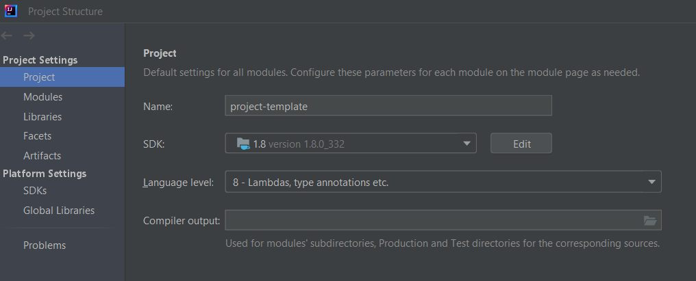

### **[Moodle BIO-410](https://moodle.epfl.ch/course/view.php?id=15721)**  

><h3 style="font-weight:500; font-size:1.6em">Project Template</h3>
>
>

## Description
This repository aims at giving you the minimal structure for your java project.
It already contains a pre-filled ``pom.xml`` file and a default package for your code.

## How to use it ?
### Fork the repository
Forking a repository is copying the repository in another account. The copied project is independent
of the parent repository ; you can then commit, push and pull on the new
repository without modifying the parent repository.

1. Click on the ``Fork`` button

  

2. On the windows, replace the name by the name of your project
3. Select your account as namespace
4. Select ``private`` visibility level
5. Click on ``Fork project``

Now the copied repository is owned by you.

### Clone the repository locally
1. Copy the repository URL
2. Open a git bash terminal on your computer, at the location where you would like to clone the repo.
3. Enter `` git clone `` and do a right click > paste to paste the repository URL.

    

### Open the project in intelliJ
1. Open your project
2. Under ``File -> Project structure``, select ``JDK 1.8`` and language level ``8``
3. Click on ``Apply`` and ``OK``

    

### Modify the pom.xml
1. Replace ``artifactID`` by the name of your project. No spaces are allowed ; only separate words by hyphens ``-``.
2. Replace ``name`` by the name of your project, in a more natural syntax.
3. Replace ``description`` by the description of your project.
4. Add you and your colleagues as ``developers``, with a pseudo, full name, optionally an url, and the roles. You can keep the roles as they are.
5. Add you and your colleagues as ``contributors``.
6. Replace ``license.copyrightOwners`` by your name and the name of your colleagues.

### Start the project 
The class ``ProjectCommand`` gives you the minimal architecture to create a plugin in Fiji. 
Populate it and create new classes with you own code related to your project.

### Generate the jar file
Under the maven center, double-click on ``insall``. It generates a ``target`` repository inside which you'll find your ``.jar`` file.

    

>**Do not forget to change the version number in the ``pom.xml``**. Here is some conventions on the version number
>- The version number is composed of 3 numbers, separated by a dot ``1.0.2``
>   - The first number ``1`` indicates the major version.
>   - The second number ``0`` indicates the minor version.
>   - The third number ``2`` indicates the bugfix version.
>- The suffix ``SNAPSHOT`` indicates that the current version is still in development and may be different from 2 snapshot files.
>You can also find the suffix ``alpha`` or ``beta``.
>
> **For the project, you just need to remove the ``SNAPSHOT`` when you generate your final jar.**
> This version, without the ``SNAPSHOT``, is called a release and should never be modified again after publishing.
> If you need to modify your code, for example, to fix bugs, then you should create a new version number.
> 
> If you would like to learn more about the versioning : [https://semver.org/](https://semver.org/) 
> and [https://www.geeksforgeeks.org/introduction-semantic-versioning/](https://www.geeksforgeeks.org/introduction-semantic-versioning/)

